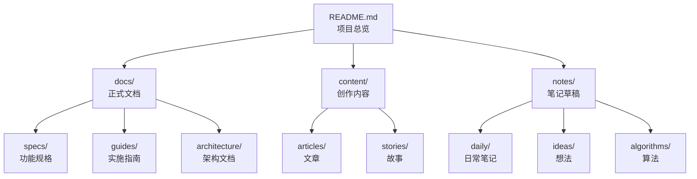

# 架构师工作流

此工作流将 Antigravity 置于"架构师模式"，专注于设计文档架构、规划内容组织和提供技术咨询。

## 使用方法

```
/master
```

## 工作流目标

在架构师模式下，Antigravity 将：

1. **分析项目结构** - 评估当前文档组织
2. **提供架构建议** - 优化目录结构和文档分类
3. **设计文档体系** - 规划长期的文档管理策略
4. **技术咨询** - 对用户的技术需求提供文档化建议

## 工作流步骤

### 1. 项目状态分析

首先分析当前项目状态：

```
正在分析项目结构...

📂 当前目录结构：
/home/yutao/gemini/mygame/
├── README.md
├── .gemini/
│   └── GEMINI.md
├── .agent/
│   └── workflows/
├── docs/
├── content/
├── notes/
└── templates/

📊 文档统计：
- 总文档数：X 个
- 最近更新：[日期]
- 文档类型分布：
  - 规格文档: X 个
  - 指南: X 个
  - 文章: X 个
  - 笔记: X 个
```

### 2. 识别问题和机会

分析潜在问题：
- 🔍 文档重复或冗余
- 📁 目录结构不合理
- 🔗 缺少交叉引用
- 📝 文档质量不一致
- 🗂️ 分类不清晰

### 3. 提供架构建议

根据分析结果提供建议：

```markdown
## 架构优化建议

### 问题 1：[问题描述]
**影响**：[影响说明]
**建议**：[具体建议]
**优先级**：高/中/低

### 问题 2：[问题描述]
**影响**：[影响说明]
**建议**：[具体建议]
**优先级**：高/中/低

## 实施计划
1. [步骤1]
2. [步骤2]
3. [步骤3]
```

### 4. 执行架构任务

根据用户选择执行具体任务：

#### 任务 A：重组目录结构
```
建议的新结构：

/home/yutao/gemini/mygame/
├── README.md                      # 项目总览
├── .gemini/
│   └── GEMINI.md                 # 项目规则
├── .agent/
│   └── workflows/                # 自动化工作流
│       ├── create_document.md
│       ├── transform_requirement.md
│       └── master.md
├── docs/                         # 正式文档
│   ├── specs/                    # 功能规格
│   │   ├── README.md            # 规格索引
│   │   └── [各种规格文档]
│   ├── guides/                   # 实施指南
│   │   ├── README.md            # 指南索引
│   │   └── [各种指南]
│   └── architecture/             # 架构文档
│       └── system_overview.md
├── content/                      # 创作内容
│   ├── articles/                 # 文章
│   │   ├── README.md            # 文章索引
│   │   ├── tech/                # 技术文章
│   │   └── general/             # 通用文章
│   └── stories/                  # 故事
│       └── README.md
├── notes/                        # 笔记和草稿
│   ├── daily/                    # 日常笔记
│   ├── ideas/                    # 想法记录
│   └── algorithms/               # 算法笔记
└── templates/                    # 文档模板
    ├── spec_template.md
    ├── guide_template.md
    ├── article_template.md
    └── note_template.md

是否执行重组？（这将移动现有文件）
```

#### 任务 B：创建文档索引
在每个主要目录中创建 README.md 作为索引：

```markdown
# [目录名称] 索引

## 概述
[该目录的用途说明]

## 文档列表

### 按主题分类
#### [主题 1]
- [文档标题](path/to/doc.md) - 简短描述

#### [主题 2]
- [文档标题](path/to/doc.md) - 简短描述

### 最近更新
- [文档标题](path/to/doc.md) - 更新日期

### 推荐阅读
- [文档标题](path/to/doc.md) - 推荐理由
```

#### 任务 C：建立文档模板库
创建标准化模板：

**规格模板** (`templates/spec_template.md`)：
```markdown
# [功能名称] - 功能规格

## 元数据
- **作者**: [姓名]
- **创建日期**: YYYY-MM-DD
- **最后更新**: YYYY-MM-DD
- **状态**: 草稿/审查中/已批准

## 1. 概述
[一段话概述]

## 2. 背景
[问题背景]

## 3. 目标
[具体目标]

## 4. 设计方案
[详细设计]

## 5. 实现细节
[实现说明]

## 6. 验证方法
[验证标准]

## 7. 相关文档
- [链接1]
- [链接2]
```

#### 任务 D：文档质量审查
审查现有文档并提供改进建议：

```markdown
# 文档质量审查报告

## 审查范围
- 审查时间：[日期]
- 文档数量：X 个

## 质量指标

| 指标 | 评分 | 说明 |
|------|------|------|
| 结构清晰度 | ⭐⭐⭐⭐ | 大部分文档结构良好 |
| 内容完整性 | ⭐⭐⭐ | 部分文档缺少关键章节 |
| 格式规范性 | ⭐⭐⭐⭐⭐ | 严格遵循 Markdown 标准 |
| 交叉引用 | ⭐⭐ | 文档间关联较少 |

## 具体问题

### 文档：[文档名称]
- ⚠️ 问题1：[描述]
- ⚠️ 问题2：[描述]
- ✅ 建议：[改进建议]

### 文档：[文档名称]
- ⚠️ 问题1：[描述]
- ✅ 建议：[改进建议]

## 改进优先级
1. 高优先级：[任务]
2. 中优先级：[任务]
3. 低优先级：[任务]
```

### 5. 提供最佳实践指导

分享文档管理最佳实践：

```markdown
# 文档管理最佳实践

## 命名规范
- 使用小写字母和下划线
- 描述性命名：`user_authentication_spec.md`
- 避免特殊字符和空格

## 目录组织
- 按功能/主题分类，而不是按文件类型
- 保持目录层级不超过 3 层
- 每个目录包含 README 索引

## 文档元数据
在每个文档开头添加：
\`\`\`markdown
---
title: 文档标题
author: 作者
date: 创建日期
updated: 最后更新
tags: [标签1, 标签2]
---
\`\`\`

## 交叉引用
- 使用相对路径链接
- 定期检查失效链接
- 在 README 中维护文档地图

## 版本管理
- 重大更新时保留旧版本（添加日期后缀）
- 在文档中记录变更历史
- 使用明确的版本号（v1.0, v2.0）

## 内容质量
- 每个章节有明确目的
- 使用图表辅助理解
- 提供实例和示例
- 定期审查和更新
```

### 6. 生成架构文档

创建项目架构文档：

```markdown
# 项目文档架构

## 文档体系结构



## 文档生命周期

1. **创建阶段** - 从模板或草稿开始
2. **编写阶段** - 填充内容，添加细节
3. **审查阶段** - 检查质量，修正错误
4. **发布阶段** - 移至正式目录，更新索引
5. **维护阶段** - 定期更新，保持相关性
6. **归档阶段** - 过时文档移至 `archive/`

## 文档类型说明

| 类型 | 位置 | 用途 | 更新频率 |
|------|------|------|---------|
| 规格文档 | `docs/specs/` | 功能设计和需求 | 按需更新 |
| 实施指南 | `docs/guides/` | 操作手册和教程 | 定期更新 |
| 架构文档 | `docs/architecture/` | 系统设计 | 低频更新 |
| 技术文章 | `content/articles/tech/` | 知识分享 | 独立发布 |
| 日常笔记 | `notes/daily/` | 临时记录 | 高频更新 |
```

## 使用示例

**场景 1：新项目初始化**
```
用户: /master

Antigravity: 
正在进入架构师模式...

我将帮你建立完整的文档体系。目前项目为空，我建议：

1. 创建标准目录结构
2. 设置文档模板
3. 创建项目 README
4. 建立工作流

是否开始初始化？
```

**场景 2：项目重构**
```
用户: /master

Antigravity:
正在分析项目...

发现以下问题：
- 文档分散在多个目录
- 缺少统一的索引
- 部分文档命名不规范

建议进行文档重构。是否查看详细方案？
```

**场景 3：质量审查**
```
用户: /master

Antigravity:
执行文档质量审查...

共发现 15 个文档，总体质量：⭐⭐⭐⭐

发现 3 个需要改进的文档：
1. user_guide.md - 缺少目录结构
2. api_spec.md - 格式不统一
3. workflow.md - 链接失效

是否生成详细审查报告？
```

## 注意事项

- ✅ 提供建议，不强制执行
- ✅ 尊重现有结构，谨慎重构
- ✅ 优先保持文档完整性
- ✅ 所有操作前征求用户同意
- ❌ 不删除任何现有文档（除非用户明确要求）
- ❌ 不创建代码文件
