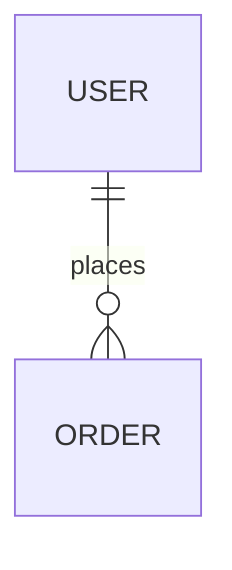
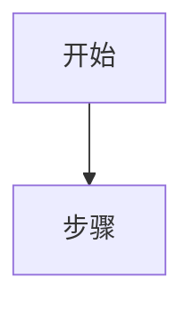

# 全自动需求转换工作流

此工作流是你的"万能命令"。它接收任何编程需求，并智能地将其转换为可实施的技术文档，无需人工干预。

## 使用方法

```
/auto <你的需求>
```
或者直接输入：
```
帮我做一个网页...
写一个Python脚本...
```
（系统会自动检测意图并接管）

## 核心逻辑

此工作流采用 **"智能推断 + 最佳实践"** 的策略：
1. **自动分类**：分析需求复杂度（脚本 vs 系统）。
2. **自动选型**：直接选择最适合的文档类型，不再询问。
3. **自动生成**：生成包含架构、代码结构和实施步骤的完整文档。

## 自动化策略

| 需求特征 | 自动匹配文档类型 | 输出目标 |
|---------|----------------|----------|
| **复杂系统** (App, 网站, 平台) | 📋 **功能规格说明书 (PRD/Design Spec)** | `docs/specs/` |
| **具体功能** (登录, 支付, API) | 📋 **功能设计文档 (Feature Spec)** | `docs/specs/` |
| **脚本/工具** (爬虫, 自动化, 批处理) | 📖 **技术实现指南 (Tech Guide)** | `docs/guides/` |
| **算法/逻辑** (排序, 计算, 转换) | 💡 **算法伪代码 (Algorithm Note)** | `notes/algorithms/` |

## 工作流步骤

### 1. 意图深度解析

分析用户输入的每一个字，提取：
- **核心实体** (e.g., 用户、订单、商品)
- **动作交互** (e.g., 购买、查询、登录)
- **技术约束** (e.g., Python, React, 高并发)

### 2. 智能文档生成

根据解析结果，**直接**生成文档内容。

**对于"Web应用/网站"类需求（生成规格书）：**

```markdown
# [项目名称] - 技术架构与实施规范

> [!NOTE]
> 本文档是由 Antigravity 根据用户需求自动生成的实施蓝图。
> **用途**：后续开发人员可直接依据本文档编写代码。

## 1. 系统概览
### 1.1 核心目标
[根据需求自动生成]

### 1.2 架构概览
- **前端**：[推荐技术栈]
- **后端**：[推荐技术栈]
- **数据库**：[推荐技术栈]

## 2. 详细设计 (Code-Ready)

### 2.1 目录结构规范
```text
/src
  /components
  /api
  /utils
```

### 2.2 核心模块定义

#### 模块 A：[名称]
- **接口路径**: `/api/v1/...`
- **请求参数**:
  - `field1`: string
- **处理逻辑**:
  1. 校验权限
  2. 查询数据库
  3. 返回结果

### 2.3 数据库设计


## 3. 分步实施计划
1. [ ] 初始化项目
2. [ ] 搭建数据库
3. [ ] 实现 API
```

**对于"脚本/工具"类需求（生成指南）：**

```markdown
# [工具名称] - 自动化脚本实施指南

## 1. 逻辑流程


## 2. 代码实现结构 (伪代码)

```python
class ToolName:
    def __init__(self):
        # 初始化配置
        pass

    def run(self):
        # 主逻辑
        pass
```

## 3. 依赖库
- `requests`
- `pandas`
```

### 3. 保存与交付

1. 自动命名文件（e.g., `web_app_spec.md`）。
2. 保存到最佳路径。
3. **输出成功卡片**：

> ✅ **需求已文档化**
>
> 你的需求 "**[用户需求摘要]**" 已被转换为可执行文档。
>
> 📄 **文档位置**: `[文件路径]`
>
> **下一步**：
> 这个文档包含了所有必要的逻辑和架构细节。你可以将该文档发送给任何开发者（或在这个项目之外的 AI），他们可以直接依据此文档编写代码。

## 触发关键词增强

除了标准关键词，增加强烈的"动作"词触发：
- "自动..."
- "生成..."
- "设计..."
- "规划..."
- "万能..."

## 质量承诺

- **Developer-Ready**: 文档不仅是描述，更是代码的"蓝图"。
- **Logic-Complete**: 包含伪代码和流程图，确保逻辑无漏洞。
- **Strictly No-Code**: 依然严格遵守不生成可执行文件的规则。
